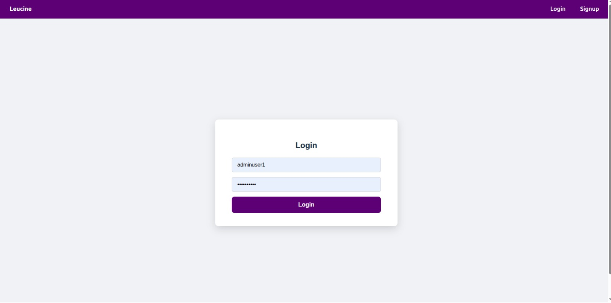
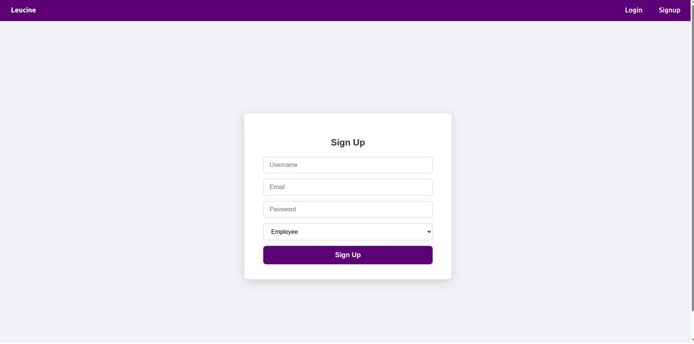
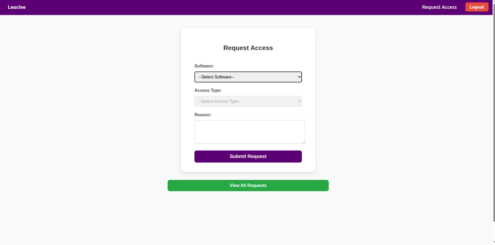
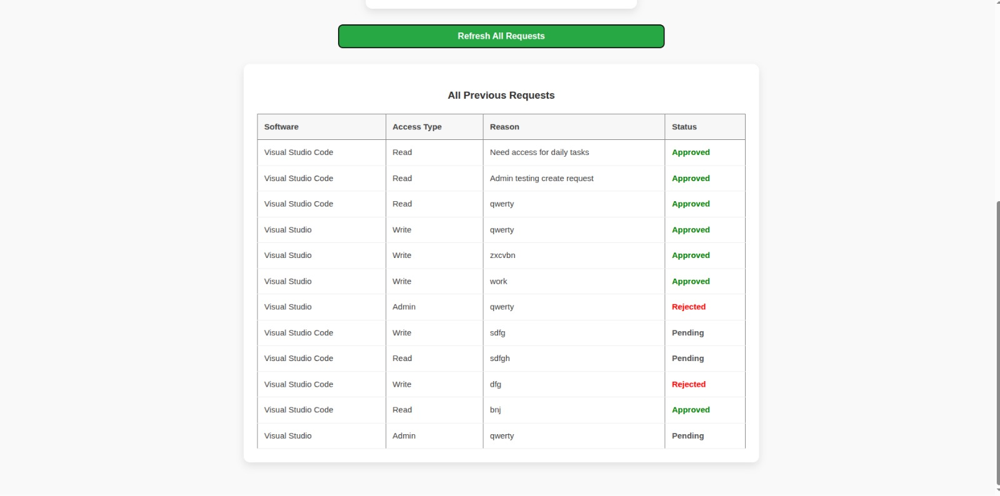
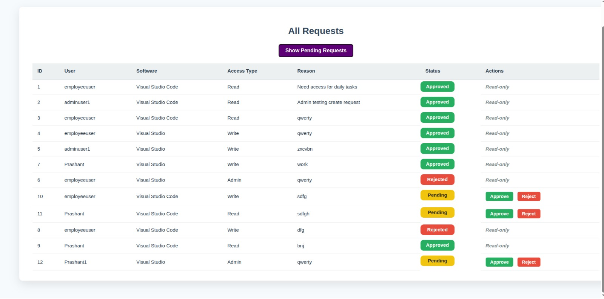
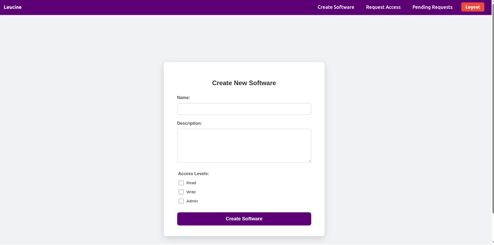
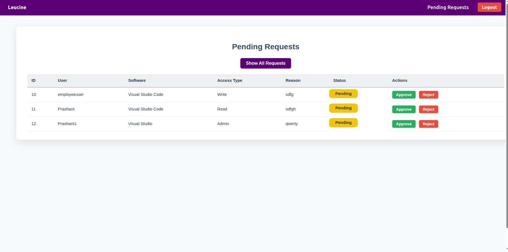

# 🛡️ User Access Management System  
Built by **Prashant Gupta – Madan Mohan Malaviya University of Technology**  
Tech Stack: **Node.js • PostgreSQL • TypeORM • JWT**

---

## 🚀 Setup Instructions

### 1. Prerequisites

- Node.js (v16 or above recommended)  
- PostgreSQL installed and running  
- npm or yarn package manager  
- Git (optional, for cloning repo)

---

### 2. Clone the repository (if applicable)

```bash
git clone https://github.com/your-repo/user-access-management.git
cd user-access-management
```

---

### 3. Install dependencies

```bash
npm install
```

---

### 4. Configure environment variables

Create a `.env` file in the root folder with the following variables:

```env
PORT=3000

DB_HOST=localhost
DB_PORT=5432
DB_USERNAME=db_username
DB_PASSWORD=db_password
DB_NAME=user_access_db

JWT_SECRET=jwt_secret_key
CLIENT_ORIGIN=http://localhost:5173
```

---

### 5. Setup the database

**Create the database manually or via psql:**

```sql
CREATE DATABASE user_access_db;
```

**Run TypeORM migrations to create tables:**

```bash
npx typeorm migration:run
```

---

### 6. Start the backend server

```bash
npm run dev
```

Server will start on [http://localhost:3000](http://localhost:3000) by default.

---

### 7. Frontend setup:

- Login page

- Signup page
 
- Request Access
 
- Review All Previous Requests

- Pending Request page

- All Requests

- Create Software page


---

## 📡 API Documentation

### Base URL

```
http://localhost:3000/api
```

---

### 1. Auth Endpoints

| Method | Endpoint     | Description       | Request Body             | Response                    |
| ------ | ------------ | ----------------- | ------------------------ | --------------------------- |
| POST   | /auth/signup | Register new user | `{ username, password }` | `{ message, userId }`       |
| POST   | /auth/login  | Login and get JWT | `{ username, password }` | `{ token, role, username }` |

---

### 2. Software Endpoints (Admin only)

| Method | Endpoint  | Description         | Request Body                               | Response                                    |
| ------ | --------- | ------------------- | ------------------------------------------ | ------------------------------------------- |
| POST   | /software | Create new software | `{ name, description, accessLevels: [] }` | `{ message, softwareId }`                   |
| GET    | /software | List all software   | None                                       | `[{ id, name, description, accessLevels }]` |

---

### 3. Access Requests (Employee & Manager)

| Method | Endpoint       | Description                | Request Body                         | Response                                   |
| ------ | -------------- | -------------------------- | ------------------------------------ | ------------------------------------------ |
| POST   | /requests      | Submit new access request  | `{ softwareId, accessType, reason }` | `{ message, requestId }`                   |
| GET    | /requests      | Get all requests (Manager) | None                                 | `[{ id, user, software, accessType, reason, status }]` |
| PATCH  | /requests/:id  | Approve or reject request  | `{ status: 'Approved' | 'Rejected' }` | `{ message, updatedRequest }`             |

---

### 4. User Role Handling

JWT token returned from login contains the user role.  
Middleware protects routes based on role:

- Employees can create requests.  
- Managers can approve/reject.  
- Admins can create software.  

---

### Headers

For protected routes, include JWT token in headers:

```
Authorization: Bearer <token>
```

---

### Sample Request - Login

```http
POST /api/auth/login
Content-Type: application/json

{
  "username": "prashant",
  "password": "prashant23"
}
```

**Response:**

```json
{
  "token": "eyJhbGciOiJIUzI1NiIsInR...",
  "role": "Employee"
}
```

---

### Sample Request - Submit Software Access Request

```http
POST /api/requests
Authorization: Bearer <token>
Content-Type: application/json

{
  "softwareId": 1,
  "accessType": "Read",
  "reason": "Need access for project"
}
```

---

## 🧱 Database Schema

### Users table

```sql
CREATE TABLE "user" (
  id SERIAL PRIMARY KEY,
  username VARCHAR(255) UNIQUE NOT NULL,
  password VARCHAR(255) NOT NULL,
  role VARCHAR(20) NOT NULL CHECK (role IN ('Employee', 'Manager', 'Admin'))
);
```

---

### Software table

```sql
CREATE TABLE software (
  id SERIAL PRIMARY KEY,
  name VARCHAR(255) NOT NULL,
  description TEXT NOT NULL,
  access_levels TEXT[] NOT NULL
);
```

---

### Requests table

```sql
CREATE TABLE request (
  id SERIAL PRIMARY KEY,
  user_id INTEGER NOT NULL REFERENCES "user"(id) ON DELETE CASCADE,
  software_id INTEGER NOT NULL REFERENCES software(id) ON DELETE CASCADE,
  access_type VARCHAR(20) NOT NULL CHECK (access_type IN ('Read', 'Write', 'Admin')),
  reason TEXT NOT NULL,
  status VARCHAR(20) NOT NULL CHECK (status IN ('Pending', 'Approved', 'Rejected')) DEFAULT 'Pending'
);
```

---
